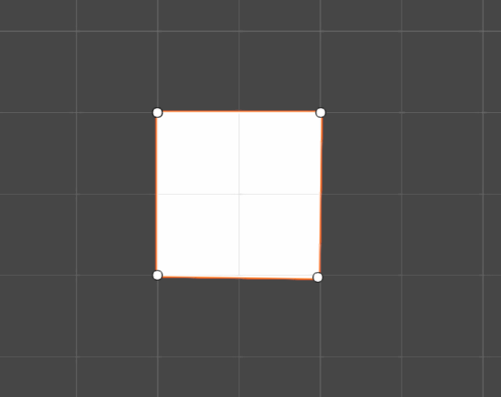

# Unity 2D SpriteShapeAnimator
An extension of the Unity 2D Sprite Shape package that allows for animation Spline points in the timeline.

In the current implementation of the *2D Sprite Shape*, it's impossible to animate a point moving using the Animation timeline. This package fixes that by adding a dummy `GameObject` on each spline point which can be moved via the animation timeline and updates the position of the spline.

Instead of a boring, static square...

 

<b>You can now do stuff like this!</b>

 

 > [!IMPORTANT]
 > The package does currently not have support for changing spline tangents. This may or may not be included in a future update.

# Adding Sprite Shape Animators to your project
**Import package, etc.**

### Using the context menu
The package adds two new Sprite Shape options to the Unity GameObject context menu: `Open Sprite Shape Animator` and `Closed Sprite Shape Animator`.
-  Right-click anywhere in Hierarchy.
-  `2D Object` -> `Sprite Shape` -> `Open Sprite Shape Animator` or `Closed Sprite Shape Animator`.

### Manually setting it up
If you don't want to use the premade options from the context menu, setting up animated sprite shapes is relatively straight forward. 
A Sprite Shape Animator needs two parts: a main GameObject with the SpriteShapeAnimator script and Animator compontents attached. A child object with the following components: a SpriteShapeRenderer, a SpriteShapeController, and an AnimationShape.
1. Create an Empty GameObject and attach a `SpriteShapeAnimator` and an `Animator` component.

2. Create a Sprite Shape via the Unity right-click context menu: 
   - `2D Object` -> `Sprite Shape` -> `Open Shape` or `Closed Shape`.
   - Attach an `AnimationShape` component.

3. Set your `SpriteShapeAnimator` as the parent of your newly created Sprite Shape.

4. Use 'Populate From Points', or enable the 'Auto Match To Spline' option to create the dummy GameObjects that represent each spline point.

5. You can now move your spline points by selecting the SpriteShapeAnimator object and using the context tool.

 

# Animating SpriteShapes in the Animator

 > [!IMPORTANT]
 > While in the Editor, animations are only played if the GameObject with the SpriteShapeAnimator is selected.

After you have set up your SpriteShapeAnimator, you can now freely use the context tool to animate any motion in the Unity Animation timeline.
- Create a new AnimationClip.
- Enable Record on the clip.
- Enable the Shape Point Context tool.
- Record your animation by moving the points via the context tool.

 
An example of animating a Sprite Shape

 

 

# Sprite Shape Animator Options
An overview of the options available in a Sprite Shape Animator.
 

|Option|Description|
| --------------------------------- | --------------------------------------------------------------------------|
| **bool** Auto Match Spline Points | Will check to see if any the Joints on this object match the spline points. If any points are removed or added, they will automatically be created on the object. |
| **button** Populate From Points   | Adds or removes Joints from the SpriteShapeAnimator, reflecting the SpriteShape's spline points.                                                                  |
| **button** Remove All Joints      | Removes all Joints from the scene.                                                                                                                                |
